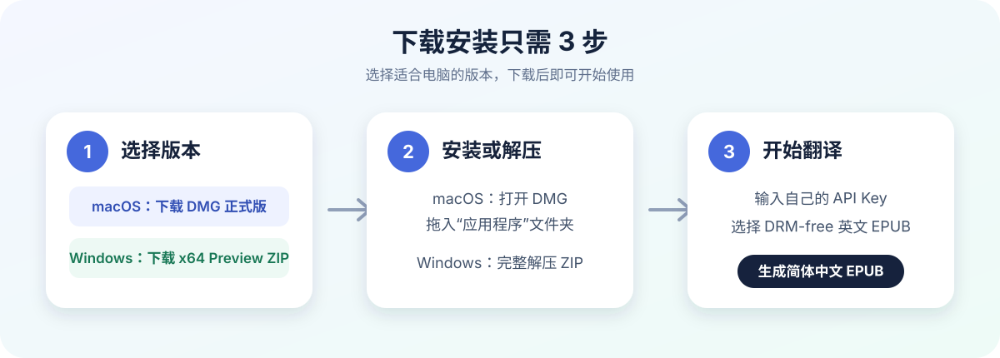
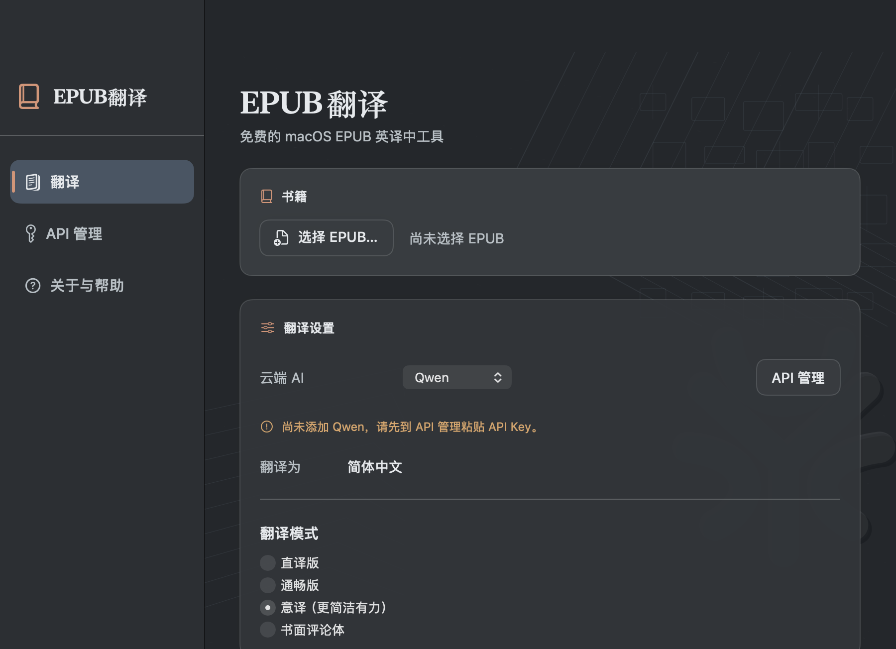
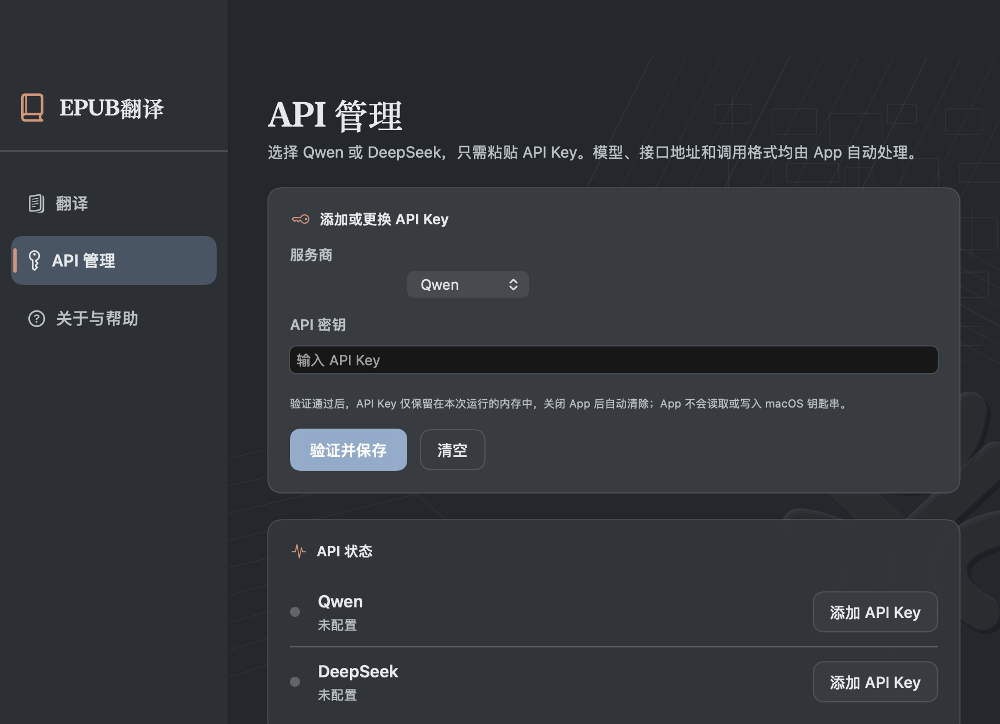
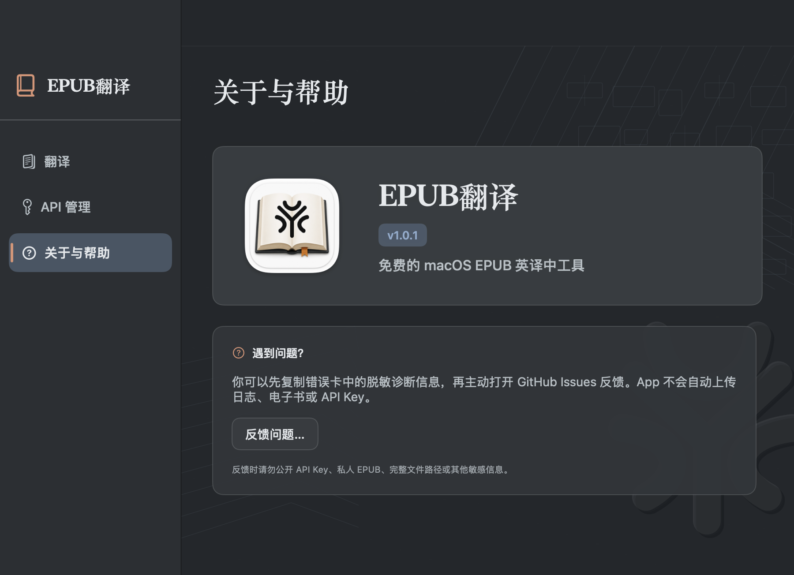
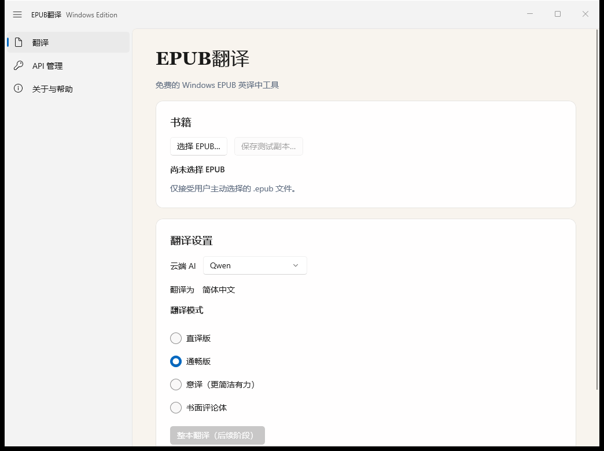
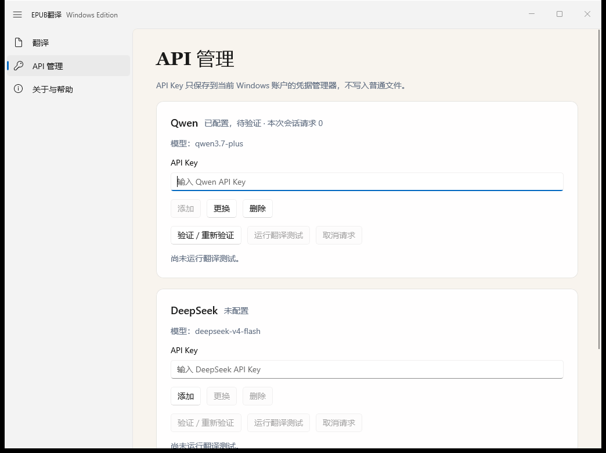
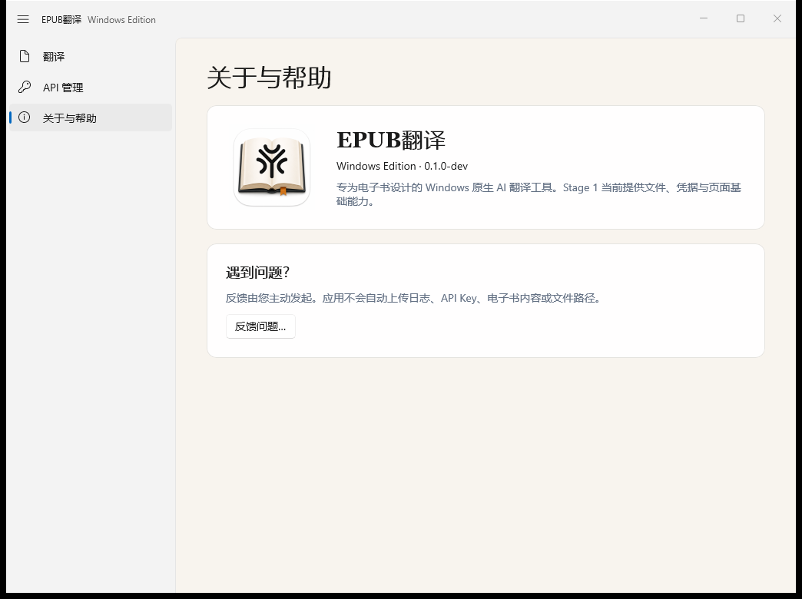

# EPUB翻译 / EPUB Translator

EPUB翻译是一款免费的跨平台 EPUB 英译中工具，支持 macOS 与 Windows。macOS 正式版同时提供 Apple 芯片和 Intel `x86_64` 两种原生安装包。它采用 BYOK（Bring Your Own Key）模式，使用用户自行提供的 Qwen（通义千问）或 DeepSeek API Key，在保留章节结构、封面、图片、链接和主要排版的前提下生成简体中文 EPUB。

本仓库现已统一保存 macOS、Windows 源码、使用说明、界面截图与版本下载。旧的下载和 Windows Preview 仓库仅用于历史兼容。

## 立即下载

| 平台 | 推荐下载 | 版本状态 | 适用设备 |
| --- | --- | --- | --- |
| macOS（Apple 芯片） | [下载 v1.0.1 DMG](https://github.com/yyttwo/EPUB-Translator/releases/download/v1.0.1/EPUB-Translator-v1.0.1.dmg) | 正式版 | M1/M2/M3/M4 系列及更新机型 |
| macOS（Intel） | [下载 Intel v1.0.1 DMG](https://github.com/yyttwo/EPUB-Translator/releases/download/v1.0.1/EPUB-Translator-v1.0.1-macOS-Intel.dmg) | 正式版 | Intel 处理器 Mac |
| Windows | [下载 x64 Preview ZIP](https://github.com/yyttwo/EPUB-Translator/releases/download/windows-v0.1.0-preview.1/EPUB-Translator-Windows-x64-Preview-v0.1.0.zip) | 预览版 | Windows 11 x64（Intel/AMD） |

### Mac 用户如何选择

- “关于本机”显示 **芯片：Apple M 系列**：下载 `EPUB-Translator-v1.0.1.dmg`。
- “关于本机”显示 **处理器：Intel**：下载 `EPUB-Translator-v1.0.1-macOS-Intel.dmg`。
- Intel 版不是 Rosetta 转译包，而是原生 `x86_64` 构建；已经在真实 Intel Mac 上完成启动和基本使用测试。

其他下载：

- [macOS v1.0.1 ZIP](https://github.com/yyttwo/EPUB-Translator/releases/download/v1.0.1/EPUB-Translator-v1.0.1.zip)
- [macOS Intel v1.0.1 ZIP](https://github.com/yyttwo/EPUB-Translator/releases/download/v1.0.1/EPUB-Translator-v1.0.1-macOS-Intel.zip)
- [macOS v1.0.1 完整发布页](https://github.com/yyttwo/EPUB-Translator/releases/tag/v1.0.1)
- [Windows x64 Preview 完整发布页](https://github.com/yyttwo/EPUB-Translator/releases/tag/windows-v0.1.0-preview.1)
- [查看全部版本](https://github.com/yyttwo/EPUB-Translator/releases)

普通用户不需要下载源码。macOS 用户打开 DMG 后将 App 拖入“应用程序”；Windows 用户应完整解压 ZIP，再运行 `EPUBTranslator.App.exe`。详细步骤见[安装指南](docs/downloads/INSTALL.md)。



> Windows 版目前是未签名的 x64 Preview，不是正式稳定版。使用前请核对 Release 中公布的 SHA-256，不要关闭 Defender 或 SmartScreen。

## 安装方法

### macOS

1. Apple 芯片 Mac 下载 `EPUB-Translator-v1.0.1.dmg`；Intel Mac 下载 `EPUB-Translator-v1.0.1-macOS-Intel.dmg`。
2. 双击打开 DMG。
3. 将“EPUB翻译.app”拖入“应用程序”文件夹。
4. 从“应用程序”中打开 EPUB翻译。

当前版本尚未进行 Apple Developer ID 签名或公证。如果首次打开被 macOS 阻止，请前往“系统设置 → 隐私与安全性”，找到对应提示并选择“仍要打开”。不需要关闭 Gatekeeper，也不要运行来源不明的终端命令。

### Windows 11 x64

1. 下载 `EPUB-Translator-Windows-x64-Preview-v0.1.0.zip`。
2. 将 ZIP 完整解压到普通文件夹；不要直接在压缩包中运行。
3. 打开解压目录中的 `EPUBTranslator.App.exe`。
4. 如果 Windows 显示安全提示，请先核对下载来源和 SHA-256。

不要为了运行应用而关闭 Defender、SmartScreen 或其他系统安全保护。更详细的图文说明见[安装指南](docs/downloads/INSTALL.md)。

## 下载文件校验

| 文件 | SHA-256 |
| --- | --- |
| `EPUB-Translator-v1.0.1.dmg` | `141c054c1ed81cf89dd783089c711f4bca5b691a0186b3045ccaee11d87e6958` |
| `EPUB-Translator-v1.0.1.zip` | `f077ebe0e59ec71bf3177779ac2eb58dead9d88b8f0f8cef2100947dcab9674e` |
| `EPUB-Translator-v1.0.1-macOS-Intel.dmg` | `24668980d934220e657ea25151113d3542f568fde2f878c64d34c93303f122a8` |
| `EPUB-Translator-v1.0.1-macOS-Intel.zip` | `9cd2e8c67250040e3b9635a34a110b20819fecaee41c80428c0acac278b093be` |
| `EPUB-Translator-Windows-x64-Preview-v0.1.0.zip` | `cfb70c3bd886129131cd0a2a0b70fe63e4556401fbd4241de37e7e27cb85c0fe` |

如果计算结果不同，请不要运行该文件，重新从本仓库 Releases 下载。

## 第一次使用

1. 打开“API 管理”页面。
2. 选择 Qwen 或 DeepSeek。
3. 输入从服务商官方平台申请的 API Key，并验证连接。
4. 返回“翻译”页面，选择无 DRM 的英文 EPUB。
5. 选择翻译风格并开始翻译。
6. 翻译完成后，将生成的简体中文 EPUB 保存到自己选择的位置。

本项目不提供或销售 API Key、Token 和第三方模型额度。服务商可能根据实际用量收费，请以其官方规则为准。

## 系统要求与版本状态

### macOS v1.0.1

- macOS 13 Ventura 或更高版本。
- 提供 Apple 芯片版和 Intel `x86_64` 版，请按处理器选择对应下载。
- Intel 版已通过真实 Intel Mac 启动和基本使用测试。
- 当前公开正式版未签名、未公证。

### Windows x64 Preview v0.1.0

- Windows 11 x64，适用于 Intel/AMD 处理器。
- 自包含、未打包、未签名的预览版本。
- 已通过 Windows x64 CI 构建、测试和隐私扫描。
- Qwen 已进行最小真实请求验证；DeepSeek 尚未完成真实请求验证。
- 当前版本不应视为正式稳定版或生产版本。

两个平台都需要无 DRM 的 EPUB、用户自己的 API Key，以及翻译期间可用的网络连接。

## 界面预览

### macOS v1.0.1

| 翻译 | API 管理 | 关于与帮助 |
| --- | --- | --- |
|  |  |  |

### Windows x64 Preview v0.1.0

| 翻译 | API 管理 | 关于与帮助 |
| --- | --- | --- |
|  |  |  |

## 功能

- DRM-free EPUB → 简体中文 EPUB
- 支持 Qwen 与 DeepSeek
- 直译、通畅、意译和书面评论体四种翻译风格
- 保留章节、封面、图片、链接和基本排版
- 支持失败重试和断点进度
- 用户自行提供 API Key；项目不销售 Token，也没有中转服务器

## 核心代码入口

### macOS 核心代码

- [`app/macOS/Sources/EPUBTranslatorApp`](app/macOS/Sources/EPUBTranslatorApp)：Swift/SwiftUI 界面、EPUB 解析与重建、翻译流程、服务商连接和进度保存。
- [`app/macOS/Sources/EPUBTranslatorHelper`](app/macOS/Sources/EPUBTranslatorHelper)：随 App 运行的辅助进程。
- [`app/macOS/Tests`](app/macOS/Tests)：macOS 单元测试与界面测试。

### Windows 核心代码

- [`app/windows/src/EPUBTranslator.Core`](app/windows/src/EPUBTranslator.Core)：翻译核心、服务商连接、任务状态、公共模型和错误处理。
- [`app/windows/src/EPUBTranslator.Platform.Windows`](app/windows/src/EPUBTranslator.Platform.Windows)：Windows Credential Manager、文件选择、AppData 和系统功能。
- [`app/windows/src/EPUBTranslator.App`](app/windows/src/EPUBTranslator.App)：WinUI 3 界面与程序入口。
- [`app/windows/tests`](app/windows/tests)：Windows 核心与平台测试。

### 其他公开内容

- [`fixtures`](fixtures)：项目自制、可公开的测试 EPUB。
- [`docs`](docs)：安装说明、版本记录和界面截图。
- [`scripts`](scripts)：构建、测试与安全扫描脚本。

### macOS 构建

需要 macOS 与 Xcode：

```bash
./scripts/build.sh
./scripts/test.sh
./scripts/test-ui.sh
```

### Windows 构建

需要 Windows 11、.NET 10 SDK 和相应 Windows 构建工具。进入 `app/windows` 后运行：

```powershell
dotnet restore EPUBTranslator.Windows.sln -p:Platform=x64
dotnet build EPUBTranslator.Windows.sln --no-restore -c Release -p:Platform=x64
dotnet test tests/EPUBTranslator.Core.Tests/EPUBTranslator.Core.Tests.csproj --no-restore -c Release -p:Platform=x64
dotnet test tests/EPUBTranslator.Windows.Tests/EPUBTranslator.Windows.Tests.csproj --no-restore -c Release -p:Platform=x64 -p:RuntimeIdentifier=win-x64
```

## API Key 与隐私

EPUB 文件结构在本机处理。翻译所需的文本片段及少量相邻上下文会直接发送给用户选择的 AI 服务商，不经过 EPUB Translator 项目服务器。

不要在 Issue、日志或截图中提交 API Key、私人 EPUB、个人路径或其他敏感信息。详情见 [PRIVACY.md](PRIVACY.md) 与 [SECURITY.md](SECURITY.md)。

## 支持与更新

- [安装指南](docs/downloads/INSTALL.md)
- [更新记录](docs/downloads/CHANGELOG.md)
- [获得支持](docs/downloads/SUPPORT.md)
- [参与开发](CONTRIBUTING.md)

## 许可证

Copyright 2026 yyttwo。

本项目采用 [GNU Affero General Public License v3.0（AGPL-3.0-only）](LICENSE) 开源。修改或分发本项目，以及通过网络向用户提供修改版功能时，请遵守 AGPL v3 的源码提供要求。第三方组件继续遵循各自许可证，详见 [THIRD_PARTY_NOTICES.md](THIRD_PARTY_NOTICES.md) 与 [Windows 第三方组件说明](app/windows/THIRD_PARTY_NOTICES.md)。
